# ExamFlow 🎓⚡

ExamFlow is a premium, AI-powered learning management and academic preparation platform. It helps students map their curricula, visualize dependencies between topics, estimate study efforts, and track mastery using interactive, modern interfaces.

---

## 📸 Visual Showcase

### 1. Unified System Dashboard
The main student workspace is a continuous dashboard displaying key statistics, pacing targets, AI insights, and active learning queues.

*   **Top (System Status & Metrics)**: Real-time syllabus coverage metrics, baseline exam countdown indicators, and quick action controls (Syllabus Manager, Shared Notes Library, Pacing Rebalance).
*   **Bottom (AI Study Coach & Heatmap)**: Dynamic regression progress forecasts, local topic confidence heatmaps, and the Gemini-powered AI Study Coach.

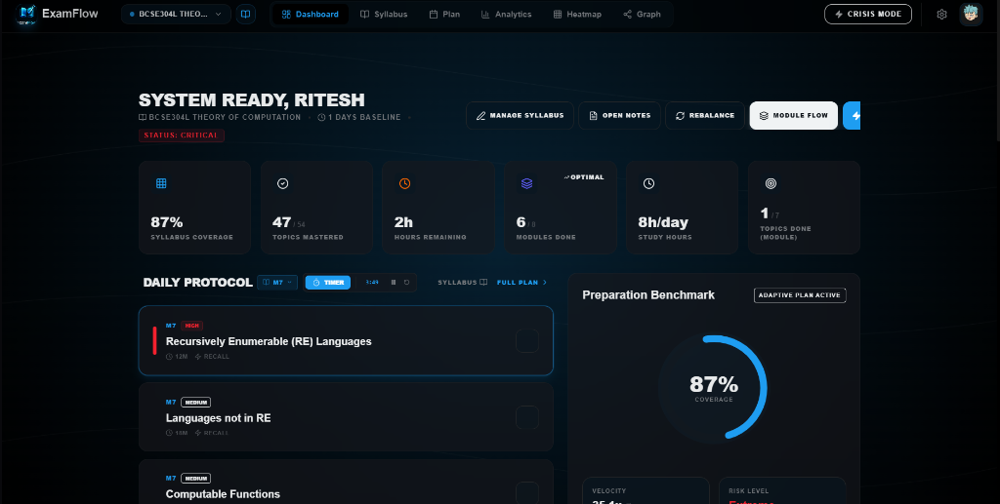
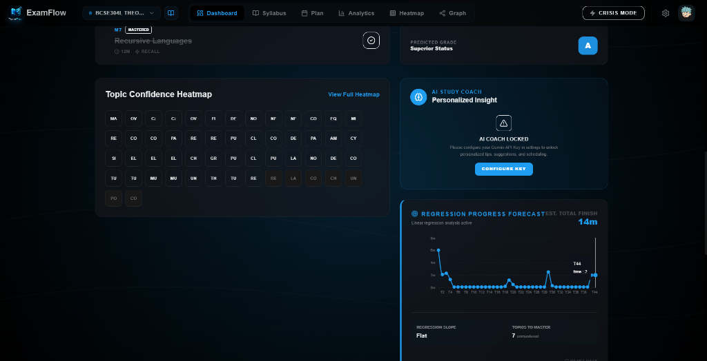

---

### 2. Neural Prerequisite Knowledge Map
A graph-based prerequisite mapping node interface showing which topics depend on others for structured, logical learning paths.

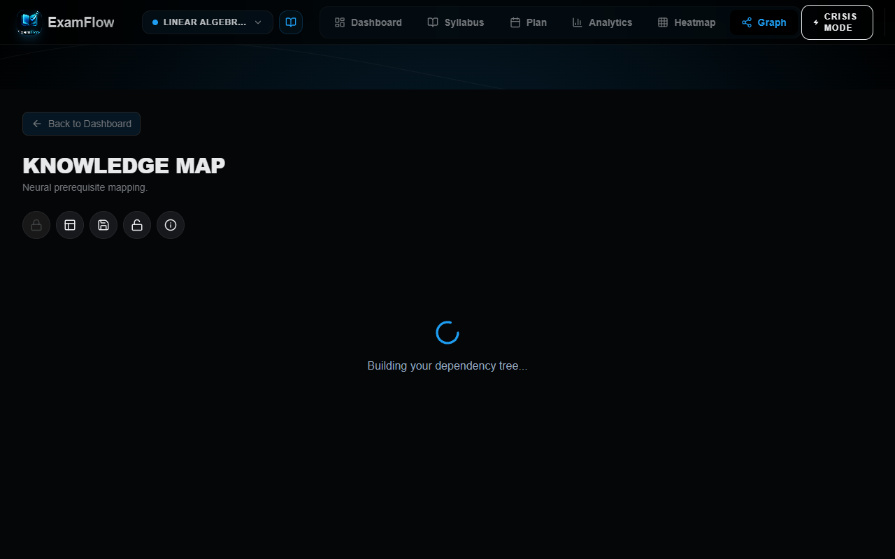

---

### 3. Adaptive Study Plan Timeline
Generates study tasks daily based on exam date targets, topic priority levels, and baseline preparation hours.

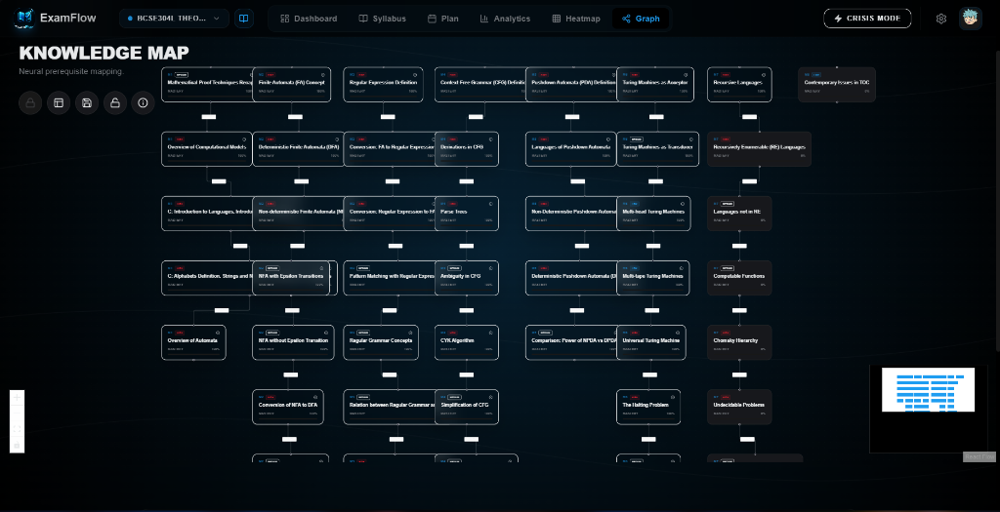

---

### 4. Curriculum Analytics & Mastery velocity
The analytics console provides granular feedback on topic preparation and module mastery levels.

*   **Top (Mastery Velocity & Priority Signal)**: Active charts showcasing preparation completion velocity over 7 cycles and readiness across difficulty vectors.
*   **Bottom (Module Breakdown & Topic Mastery)**: Visual progress bars of individual modules and a detailed table tracking the status of every topic in the syllabus.

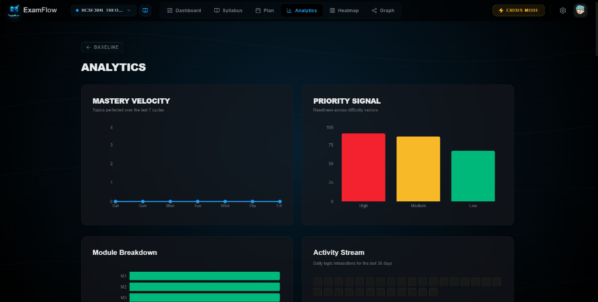
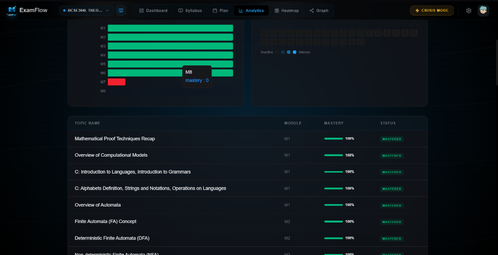

---

### 5. Mastery Heatmap & Syllabus Matrix
*   **Mastery Heatmap**: Full-screen grid visualization of curriculum modules, highlighting weaker areas vs. mastered concepts in distinct shades.
*   **Syllabus Matrix**: Comprehensive topics list partitioned by modules to review estimated learning durations and dependency details.

| Full Mastery Heatmap | Syllabus Matrix |
|---|---|
| 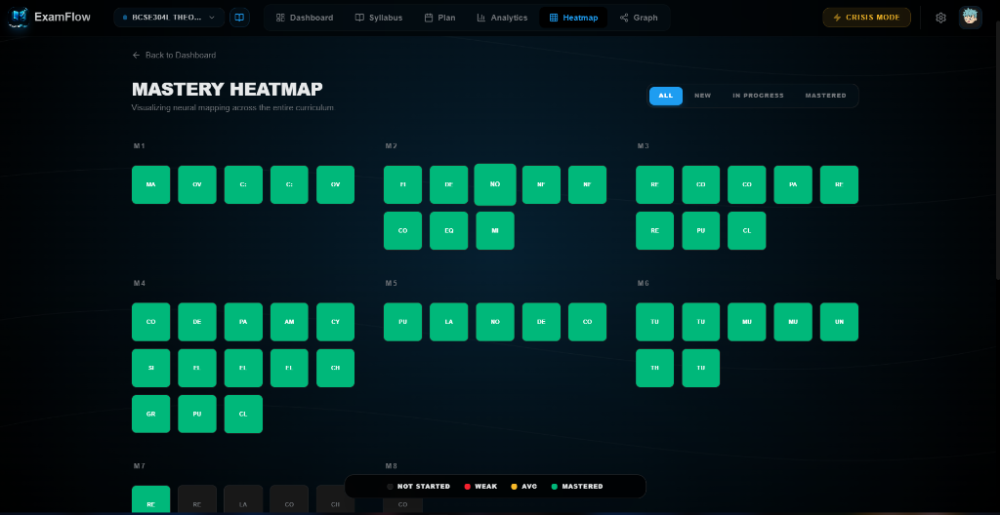 | 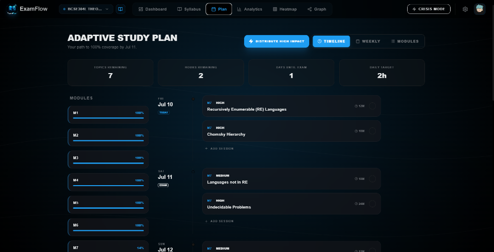 |

---

### 6. Control Center & Preference Calibration
Adjust settings, calibrate active learning logic ("Adaptive Flow" vs. "Module Linear"), customize styling spectrums (Dark / Light mode, custom colors), configure personal credentials, and manage Gemini API keys.

| Profile tab | Calibration Preferences |
|---|---|
| 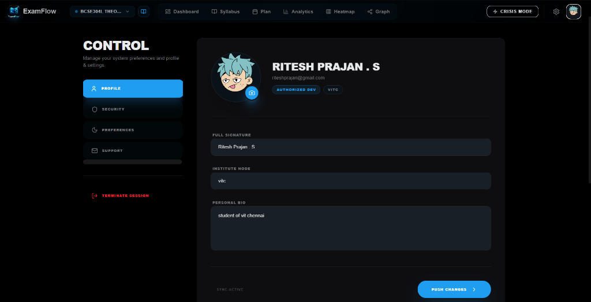 | 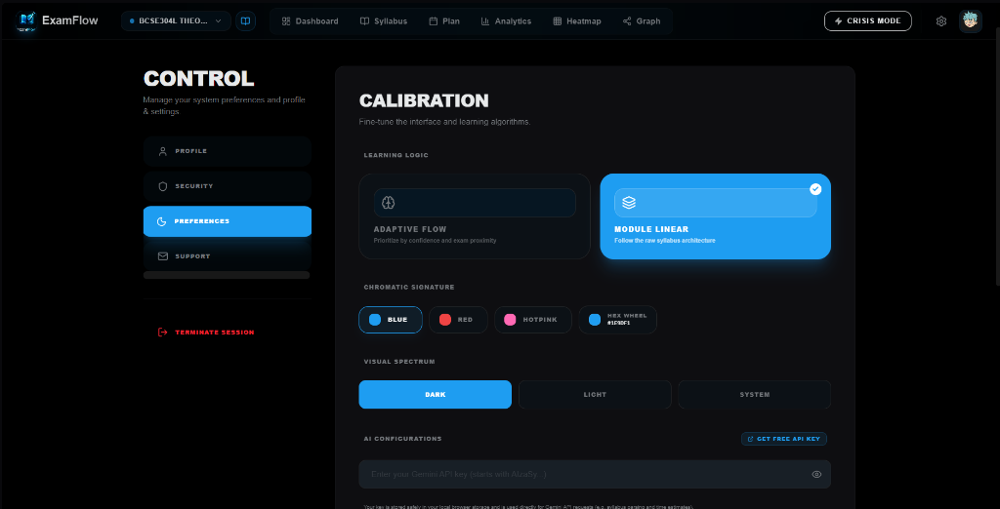 |

---

### 7. Dual Vector Auth & Contact Channels
Configure dual-factor verification parameters or reach out to support networks.

| Security Matrix | Support Protocol |
|---|---|
| 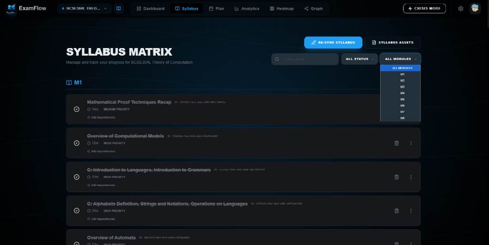 | 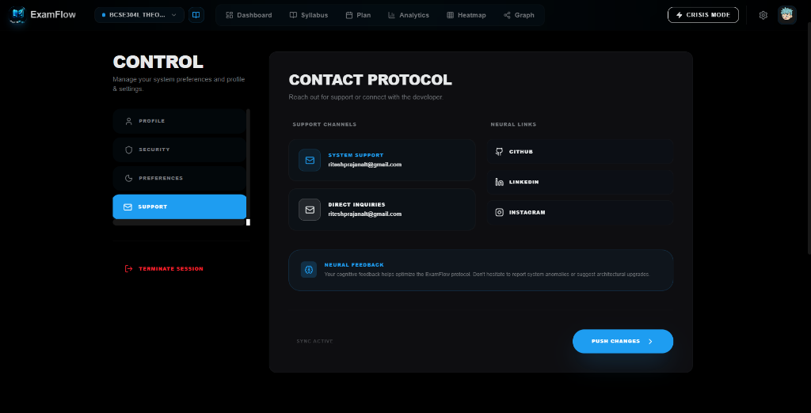 |

---

## 🚀 Key Features

*   **Neural Prerequisite Mapping (Knowledge Map)**: Graph-based prerequisite visualization showing which topics depend on others for structured learning.
*   **Dynamic Study Planner & Scheduler**: Calculates weekly pacing, topic countdowns, and exam preparation trackers based on actual exam dates.
*   **Pomodoro Deep Work Dashboard**: Immersive timers, Pomodoro focus loops, and intervals namespaced by user session to avoid cross-device data bleeding.
*   **AI Syllabus Topic Parser**: Throttled and rate-limited backend syllabus parser that automatically breaks down PDF/DOCX syllabi into distinct topics and modules.
*   **Bring-Your-Own-Key (BYOK) Security Model**: Fully masked, configurable Gemini API key preferences stored securely in client storage to avoid server-side billing abuse.
*   **Automated Rules Testing**: Fully integrated security validation runner checking Firestore safety policies against industry vulnerability patterns.

---

## 🛠️ Getting Started

### Prerequisites
*   [Node.js](https://nodejs.org/) (v18 or higher)
*   [Firebase CLI](https://firebase.google.com/docs/cli) (optional, for local rules emulation)

### Installation
1.  **Clone the repository**:
    ```bash
    git clone https://github.com/ritesh-prajan/ExamFLow.git
    cd ExamFlow
    ```
2.  **Install dependencies**:
    ```bash
    npm install
    ```
3.  **Run Development Server**:
    ```bash
    npm run dev
    ```
4.  **Production Compile**:
    ```bash
    npm run build
    ```

---

## 🔒 Security Configuration

### Security Headers & Netlify Hosting
This project ships with pre-configured secure server redirect mappings and strict security headers in [netlify.toml](netlify.toml) including:
*   `Content-Security-Policy (CSP)`
*   `Strict-Transport-Security (HSTS)`
*   `X-Frame-Options: DENY`
*   `X-Content-Type-Options: nosniff`

### Automated Security Rules Testing
We use Vitest and the Firebase Rules Unit Testing SDK to automatically test security policy rules. To execute the security suite (requires local Java JRE):
```bash
npm run test:rules
```
