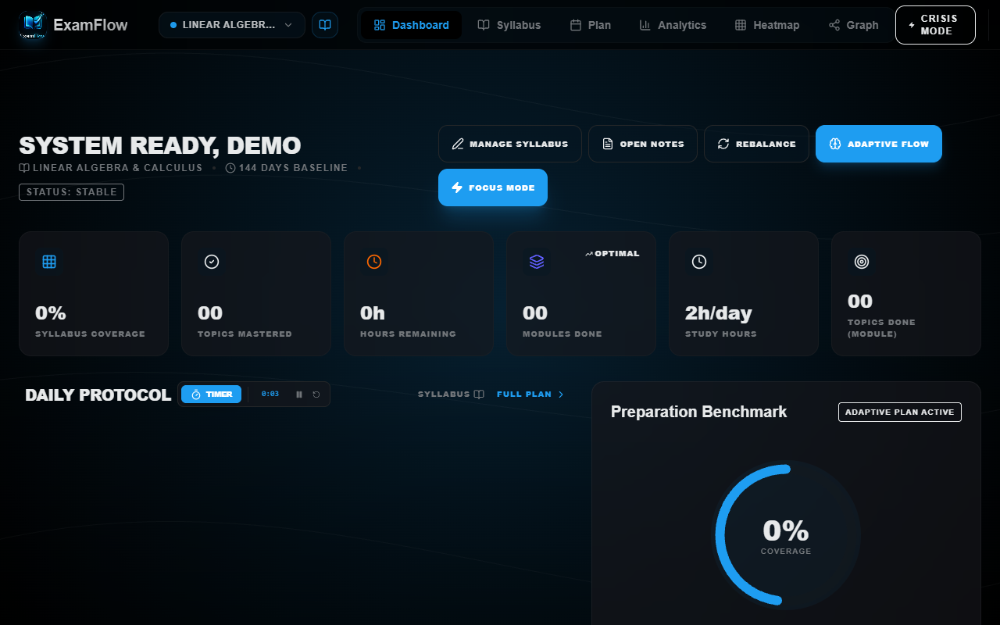
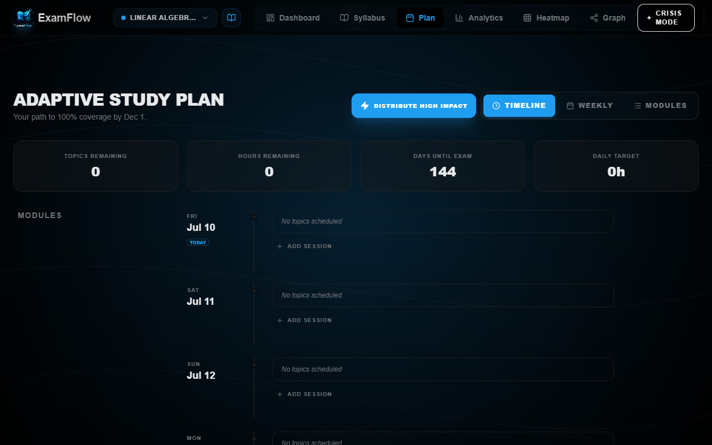
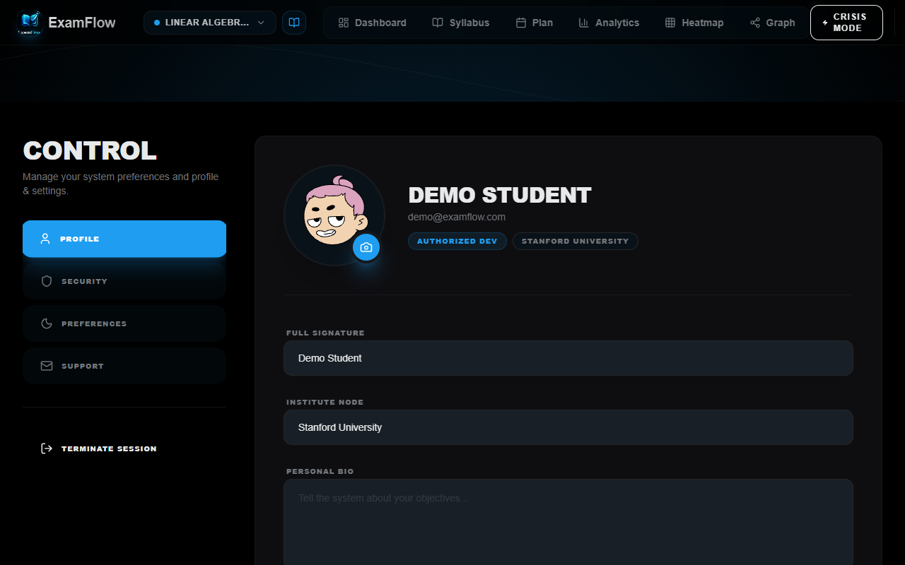

# ExamFlow 🎓⚡

ExamFlow is a premium, AI-powered learning management and academic preparation platform. It helps students map their curricula, visualize dependencies between topics, estimate study efforts, and track mastery using interactive, modern interfaces.

---

## 📸 Screenshots

### Welcome Landing Page


### Immersive Study Dashboard


### Neural Prerequisite Knowledge Map


### Dynamic Study Plan


### Preferences & Security Settings


---

## 🚀 Key Features

*   **Neural Prerequisite Mapping (Knowledge Map)**: Graph-based prerequisite visualization showing which topics depend on others for structured learning.
*   **Dynamic Study Planner & Scheduler**: Calculates weekly pacing, topic countdowns, and exam preparation trackers based on actual exam dates.
*   **Pomodoro Deep Work Dashboard**: Immersive timers, Pomodoro focus loops, and intervals namespaced by user session to avoid cross-device data bleeding.
*   **AI Syllabus Topic Parser**: Throttled and rate-limited backend syllabus parser that automatically breaks down PDF/DOCX syllabi into distinct topics and modules.
*   **Bring-Your-Own-Key (BYOK) Security Model**: Fully masked, configurable Gemini API key preferences stored securely in client storage to avoid server-side billing abuse.
*   **Automated Rules Testing**: Fully integrated security validation runner checking Firestore safety policies against industry vulnerability patterns.

---

## 🛠️ Getting Started

### Prerequisites
*   [Node.js](https://nodejs.org/) (v18 or higher)
*   [Firebase CLI](https://firebase.google.com/docs/cli) (optional, for local rules emulation)

### Installation
1.  **Clone the repository**:
    ```bash
    git clone https://github.com/ritesh-prajan/ExamFLow.git
    cd ExamFlow
    ```
2.  **Install dependencies**:
    ```bash
    npm install
    ```
3.  **Run Development Server**:
    ```bash
    npm run dev
    ```
4.  **Production Compile**:
    ```bash
    npm run build
    ```

---

## 🔒 Security Configuration

### Security Headers & Netlify Hosting
This project ships with pre-configured secure server redirect mappings and strict security headers in [netlify.toml](netlify.toml) including:
*   `Content-Security-Policy (CSP)`
*   `Strict-Transport-Security (HSTS)`
*   `X-Frame-Options: DENY`
*   `X-Content-Type-Options: nosniff`

### Automated Security Rules Testing
We use Vitest and the Firebase Rules Unit Testing SDK to automatically test security policy rules. To execute the security suite (requires local Java JRE):
```bash
npm run test:rules
```
